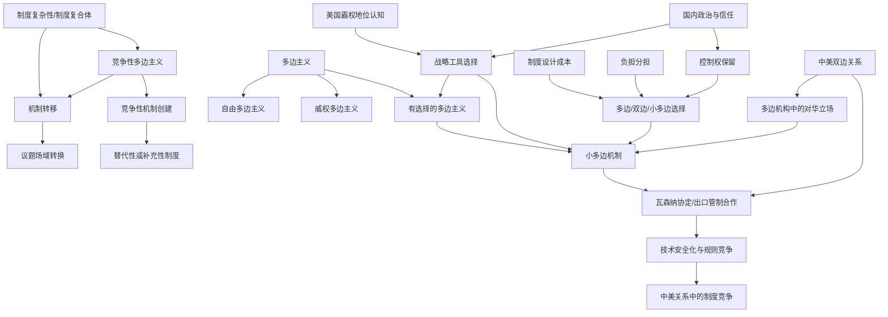
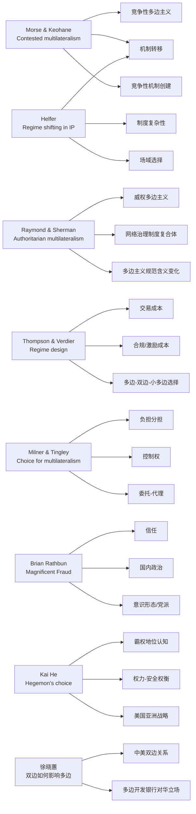
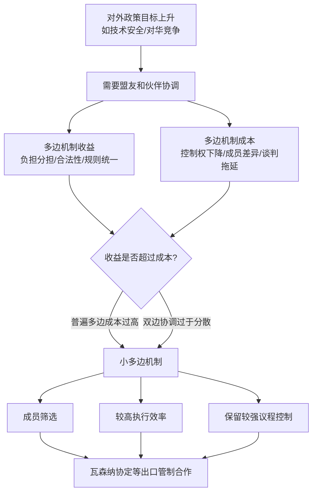
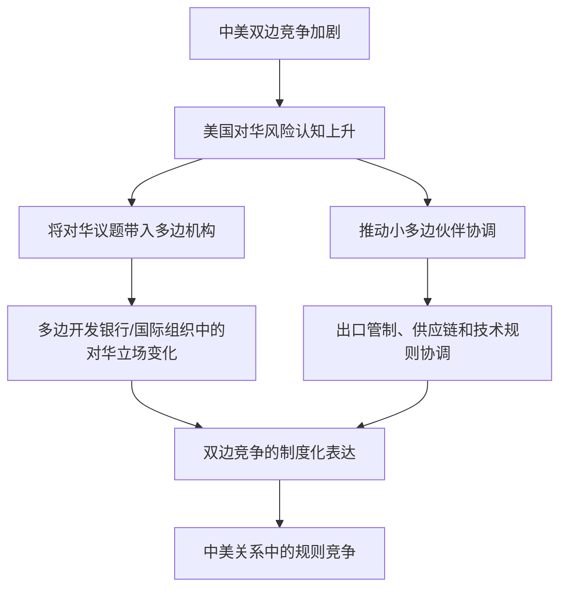
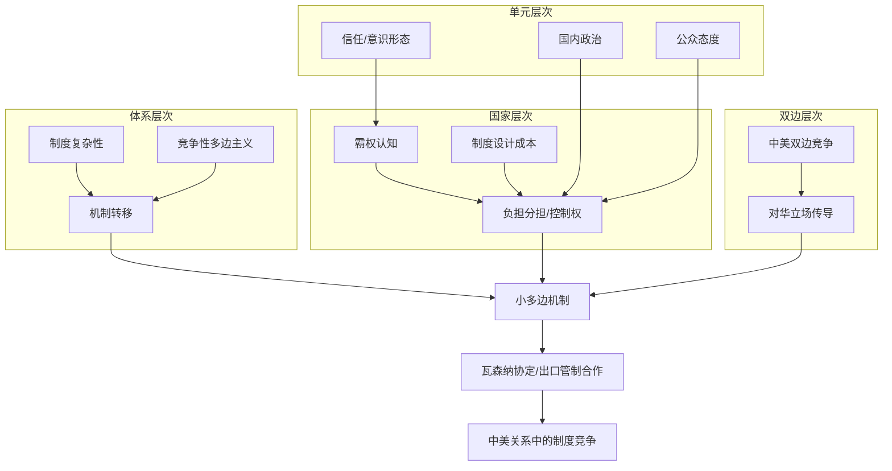

# 知识网络图谱与因果逻辑图

## 使用说明

本文件是在八篇文献笔记和 `literature_matrix.md` 的基础上生成的可视化辅助材料，目的是帮助后续写作把“机制转移—多边主义—瓦森纳协定/小多边—中美关系”之间的关系图谱化。图中箭头表示概念、变量或解释路径之间的分析关系，不表示已经由所有文献共同证明的单一因果结论。对于正文读取受限的中文文献，本图只使用其可确认的研究主题：中美双边关系与多边开发银行对华立场。

## 一、总体知识网络图谱

### 图谱解读

1. **体系层次主轴**：制度复杂性为机制转移和竞争性多边主义提供条件。Morse 与 Keohane 提供“竞争性多边主义”的总概念，Helfer 说明制度复合体如何让机制转移成为可行策略。
2. **多边主义类型主轴**：Raymond 与 Sherman 提醒我们，多边主义不是固定等同于自由多边主义，也可能出现威权多边主义或有选择的多边主义。
3. **制度工具选择主轴**：Thompson 与 Verdier、Milner 与 Tingley 共同说明，多边、双边和小多边选择涉及交易成本、激励适配、负担分担和控制权之间的权衡。
4. **美国战略与国内政治主轴**：Kai He 解释霸权认知如何影响美国战略工具选择；Rathbun 以及 Milner 与 Tingley 则补充美国国内政治、信任和公众态度的影响。
5. **中美关系传导主轴**：徐晓蕙的研究主题提示，中美双边关系可以进入多边机构并影响美国对华立场；这一逻辑也可作为理解小多边出口管制机制的连接点。

## 二、文献—概念对应图

### 图谱解读

该图用于避免把八篇文献简单串联成读书笔记。每篇文献提供的概念位置不同：有的提供体系层次概念，有的提供制度设计机制，有的解释美国国内偏好，有的连接中美双边关系与多边场域。后续综述可以先讨论概念簇，再把具体文献放入相应位置。

## 三、因果逻辑图一：制度复杂性如何导致机制转移

### 适用范围

该逻辑主要来自竞争性多边主义和知识产权机制转移文献。用于本文时，可解释为什么国家在技术安全化后可能从普遍性贸易制度转向出口管制、小多边安全合作或其他替代场域。

## 四、因果逻辑图二：美国为何选择小多边机制

### 适用范围

该图综合 Thompson 与 Verdier 的制度设计成本逻辑，以及 Milner 与 Tingley 的负担分担—控制权逻辑。它不把小多边机制写成单纯“更好”的制度，而是把它视为在普遍多边和双边安排之间进行折中的结果。

## 五、因果逻辑图三：霸权认知与制度工具选择

### 适用范围

该图对应 Kai He 的权力—安全与霸权认知思路。写作时需注意，它解释的是美国战略偏好变化；它与“制度复杂性导致机制转移”是并列解释，而不是先后递进关系。

## 六、因果逻辑图四：中美双边关系如何进入多边/小多边场域

### 适用范围

该图主要用于连接徐晓蕙文章的研究主题与本文的小多边机制讨论。由于中文 PDF 正文无法完整读取，图中只保留“中美双边关系影响多边场域”这一低限度、可由题名确认的研究方向，不添加未核验的具体变量或案例结论。

## 七、四层次综合逻辑图

### 图谱解读

四层次图将文献综述的结构压缩为一个综合框架：体系层次解释制度场域为何可转移，国家层次解释美国为何选择小多边工具，双边层次解释中美关系如何进入多边场域，单元层次解释美国国内政治如何影响制度偏好。四个层次是并列解释来源，不能写成单线递进关系。
